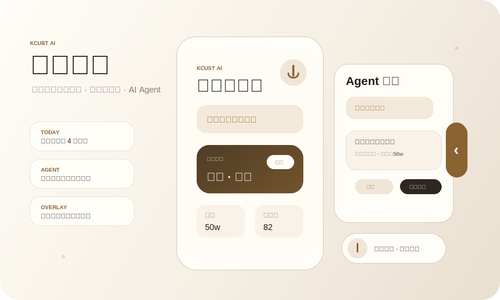
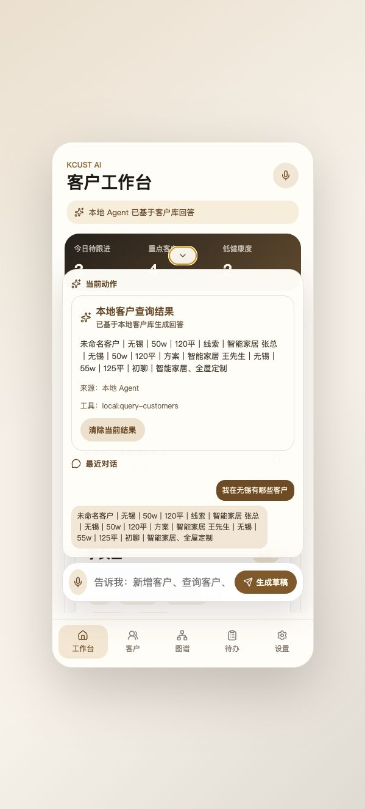

<p align="center">
  
</p>

<h1 align="center">KCUST AI</h1>

<p align="center">
  <strong>家装全案定制行业的客户管理 Agent</strong>
</p>

<p align="center">
  客户工作台、结构化客户档案、待办提醒和系统级悬浮助手，围绕设计师每天真实跟进客户的节奏构建。
</p>

<p align="center">
  
  
  
  
  
</p>

<p align="center">
  
</p>

## 一句话

KCUST AI 不是传统 CRM 表格，也不是单纯的聊天机器人。它把家装客户资料、沟通记录、待办提醒和 AI Agent 放在同一个移动工作台里，让“今天该跟进谁、客户说过什么、下一步要做什么”变成一个连续闭环。

## 界面预览

<table>
  <tr>
    <td width="48%">
      
    </td>
    <td width="52%">
      <h3>客户工作台叠加 Agent</h3>
      <p>Agent 不单独变成一个孤立聊天页，而是服务于客户、待办、提醒和沟通记录。用户可以在工作台里查看今日重点，在 Agent 页里处理复杂指令，也可以通过安卓悬浮窗在其他 App 上方快速录入。</p>
      <ul>
        <li>当前动作与确认卡片</li>
        <li>对话历史与处理中间态</li>
        <li>语音输入、结构化草稿、确认保存</li>
        <li>客户资料、待办和沟通记录联动</li>
      </ul>
    </td>
  </tr>
</table>

## 产品爆点

<table>
  <tr>
    <td width="50%">
      <h3>客户工作台优先</h3>
      <p>首屏聚焦今日待跟进、重点客户、低健康度客户和下一步建议，打开 App 就进入工作状态。</p>
    </td>
    <td width="50%">
      <h3>一句话沉淀客户资料</h3>
      <p>从“客户微信名、工地城市、预算、需求、沟通内容、是否加急、服务价值”等自然语言中生成结构化草稿。</p>
    </td>
  </tr>
  <tr>
    <td width="50%">
      <h3>本地客户库问答</h3>
      <p>例如“我现在在湖北省，告诉我这边哪些地级市有沟通中的客户”，回答基于本地客户、待办和沟通记录。</p>
    </td>
    <td width="50%">
      <h3>待办提醒闭环</h3>
      <p>客户要求去工地、给图纸、开会或回访时，Agent 生成提醒草稿；确认后创建 App 内提醒并尝试写入安卓日历。</p>
    </td>
  </tr>
  <tr>
    <td width="50%">
      <h3>安卓系统级悬浮助手</h3>
      <p>授权后可在其他 App 上方呼出轻量悬浮窗，查看最近待办、按住录音、让 Agent 处理客户指令。</p>
    </td>
    <td width="50%">
      <h3>默认确认再写入</h3>
      <p>新增客户、更新客户、沟通记录和提醒都先生成确认卡片，避免 AI 静默修改客户资料。</p>
    </td>
  </tr>
</table>

## 功能地图

| 模块 | 能力 |
| --- | --- |
| 工作台 | 今日待跟进、重点客户、健康度提醒、下一步建议 |
| 客户 | 客户 CRUD、客户详情、回收站、需求标签、画像摘要 |
| Agent | 意图识别、结构化草稿、客户查询、批量动作、处理中间态 |
| 待办 | 客户关联待办、到期时间、完成状态、通知与日历写入 |
| 悬浮窗 | 侧边吸附、底部按住录音、最近待办、确认卡片 |
| 设置 | 模型选择、悬浮窗参数、原生能力状态、回收站 |

## 家装客户字段

KCUST AI 的客户结构围绕家装全案定制场景设计：

```text
客户姓名 / 微信名 / 城市 / 预算 / 面积 / 房型
家庭结构 / 来源渠道 / 风格偏好 / 需求标签
沟通内容 / 需求日期 / 是否加急 / 服务价值
下一步动作 / 待办提醒 / 客户健康度
```

## 技术架构

```text
React + TypeScript + Vite
          |
          v
Capacitor mobile shell
          |
          v
Android native plugins
  - Floating Assistant Service
  - iFlytek ASR
  - Calendar bridge
  - Local notification bridge
  - Android Keystore
```

## 技术栈

<table>
  <tr>
    <td><strong>Frontend</strong></td>
    <td>React, TypeScript, Vite, mobile-first CSS</td>
  </tr>
  <tr>
    <td><strong>Native</strong></td>
    <td>Capacitor, Android Java, system overlay, notification, calendar, Keystore</td>
  </tr>
  <tr>
    <td><strong>Agent</strong></td>
    <td>OpenAI-compatible Chat Completions, local guardrails, structured confirmation cards</td>
  </tr>
  <tr>
    <td><strong>Voice</strong></td>
    <td>iFlytek Chinese ASR on Android, text fallback on Web preview</td>
  </tr>
  <tr>
    <td><strong>Quality</strong></td>
    <td>Vitest, ESLint, Android Gradle build</td>
  </tr>
</table>

## 隐私与安全

- 真实模型网关参数不提交到仓库。
- 真实科大讯飞参数不提交到仓库。
- `.env.local`、`android/local.properties`、构建产物和本地 SDK 文件均被忽略。
- Agent 写入客户资料前需要用户确认。
- 模型调用前会生成数据范围披露，避免静默发送客户库内容。

## 快速开始

```bash
npm install
cp .env.example .env.local
npm run dev -- --host 127.0.0.1
```

`.env.local` 用于配置 OpenAI-compatible 模型网关：

```bash
VITE_MODEL_GATEWAY_BASE_URL=https://your-model-gateway.example/v1
VITE_MODEL_GATEWAY_API_KEY=your-local-api-key
```

## 常用命令

```bash
npm test
npm run lint
npm run build
npx cap sync android
```

Android Java 编译需要本机安装 JDK 21：

```bash
cd android
cp local.properties.example local.properties
./gradlew :app:compileDebugJavaWithJavac
```

`android/local.properties` 用于配置 Android SDK 路径和科大讯飞中文识别大模型参数：

```properties
sdk.dir=/path/to/android-sdk
iflytek.appId=your-app-id
iflytek.apiKey=your-api-key
iflytek.apiSecret=your-api-secret
```

科大讯飞原生语音依赖需要放在 `android/app/libs/` 下；这些本地 SDK 文件不会提交到仓库。

## Android Native Preflight

真机 QA 前建议先运行：

```bash
scripts/android-preflight.sh
```

该脚本会检查 Java、Gradle Wrapper、Android SDK 环境变量、adb 和已连接设备。

## 文档

- [隐私与模型数据说明](docs/privacy.md)
- [Android QA 清单](docs/android-qa.md)
- [剩余工作计划](docs/superpowers/plans/2026-05-26-kcust-ai-remaining-work.md)

## 项目状态

这是一个持续迭代中的个人客户管理 Agent 原型。当前重点是打磨安卓真机体验、悬浮窗语音交互、模型 Agent 稳定性和家装客户字段结构化能力。
